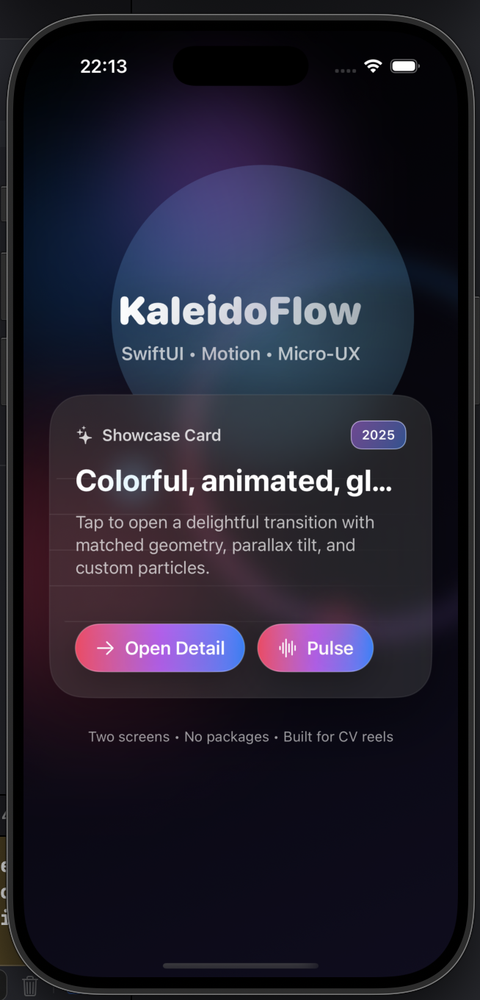
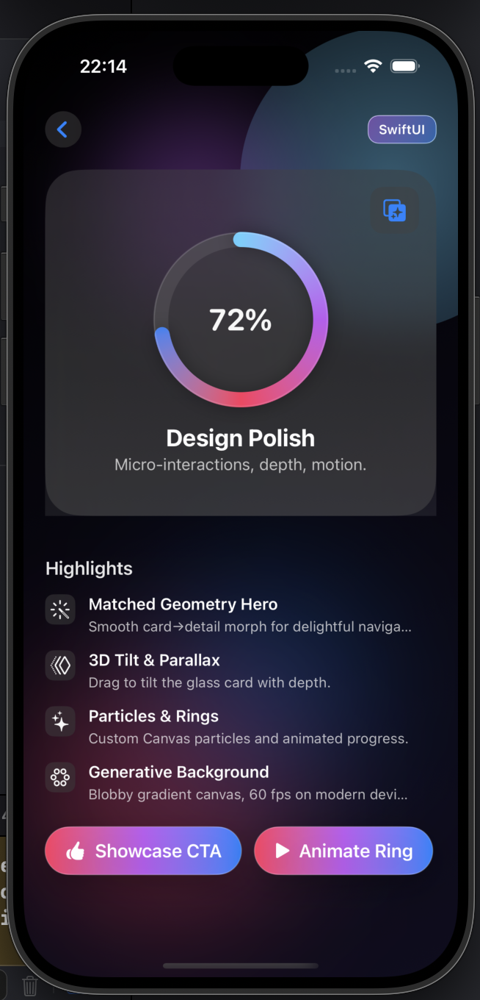

# KaleidoFlowApp

A two-screen showcase app built with **SwiftUI**, focused on **UI/UX design polish**.  
This mini project was created for portfolio/CV purposes to demonstrate skills in animation, transitions, and modern iOS design patterns.

---

## ✨ Features
- **Glassmorphism card** with depth, shadows, and gradients  
- **3D tilt & parallax** effect using drag gestures  
- **Matched Geometry transitions** for smooth navigation  
- **Animated blob background** (Canvas + TimelineView)  
- **Custom particles & animated progress ring**  
- **Haptic feedback & micro-interactions**

---

## 📸 Screenshots
## Project Interface Screenshots:

  
  

## 🎞 Demo (GIF)

  

---

## 🎯 Purpose
- This app is not a full product — it’s a UI/UX demo project that highlights design skills, animation techniques, and SwiftUI capabilities in a compact way.
- 🛠 Tech Stack
- Swift, SwiftUI
- Canvas / TimelineView (for animated background)
- MatchedGeometryEffect
- UIKit Haptics
